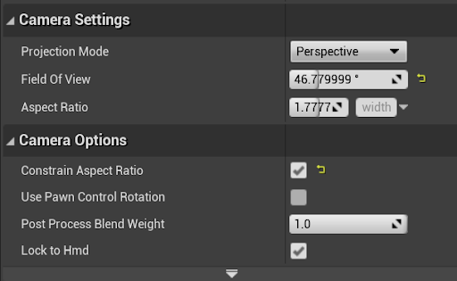

#### Below, you will find information about the key C++ classes and Blueprints that are used to adapt projects for use in the Visualization Studio, as well as some basic functionality information. Most of this information describes what these elements do, so it is recommended that you read this section. However, this information isn’t necessarily critical for basic use.

---

## Major Blueprints and Classes:
### VizStudioGameInstance
* This should be selected as the Game Instance Class in the Maps & Modes tab of the Project Settings
* A C++ class the handles the creation of new players with the proper settings

### VizGameMode
* Should be set as the Default GameMode in the Maps & Modes tab of the Project Settings
* Handles the spawning, positioning, and appropriate parenting of all player Pawns and applies important settings for rendering
* Spawns 9 local players using the VizStudioGameInstance C++ class (these are all VizCameraReceiverPawns
    * Upon completion, the first of those Pawns is Unpossessed and Destroyed before being replaced by a VizParentPawn to which all of the other VizCameraReceiverPawns are attached, each offset to form a circle.
* Executes console commands to perform Panini Projection
    * Unreal’s Panini Projection is used to reduce the effects of perspective on the edges of the cameras. This helps create a more seamless appearance between cameras.
* Spawns an ASplitScreenManagerBP actor in the level when play begins

### ASplitScreenManager/ASplitScreenManagerBP
* A C++ class and an actor from that class that overrides and applies new settings to allow for 9 local players with 8 total cameras in split screen
    * These 9 players consist of 8 VizCameraReceiverPawns and 1 VizParenPawn

### VizCameraReceiverPawn
* This BP actor is a player Pawn that consists of a camera with appropriate settings. 
* This class is intended purely as an owner for a camera. They should not be directly edited or changed at runtime. These changes should be made through the VizParentPawn.
* This Pawn is possessed by a PlayerController

### VizParentPawn
* This BP actor should be thought of as the main player Pawn.
* Movement and other inputs should be handled by this Pawn. The VizCameraReceiverPawns are attached to this Pawn, so they are moved by it.
    * Additionally, this Pawn contains arrays with references to each of the VizCameraReceiverPawns and their Camera components.
* This Pawn is possessed by a VizPlayerController

### VizPlayerController
* The PlayerController class that possesses the VizParentPawn

---

## VizCameraReceiverPawn Camera Settings:
The unique arrangement of cameras requires that a few camera and post processing settings remain unchanged.

These settings are:
* Field of View (46.779999)
* Aspect Ratio (1.7777777)
* Constrain Aspect Ratio (True)
* Exposure (The following settings must be enabled and set to the following values)
    * Metering Mode (Manual)
    * Exposure Compensation (0.0)
    * Apply Physical Camera Exposure (False)
* Image Effects (The following setting must be enabled and set to the following value)
    * Vignette Intensity (0.0)

